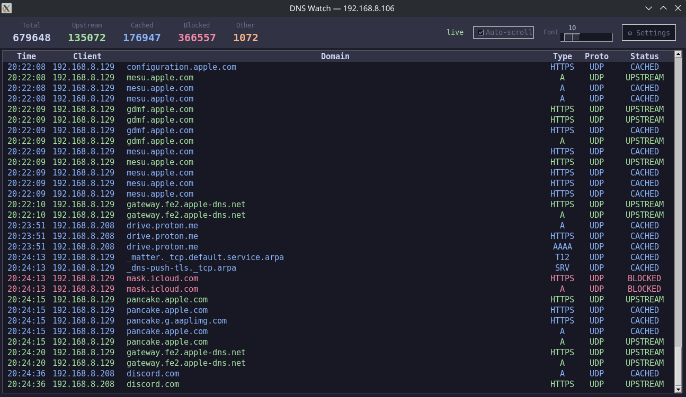
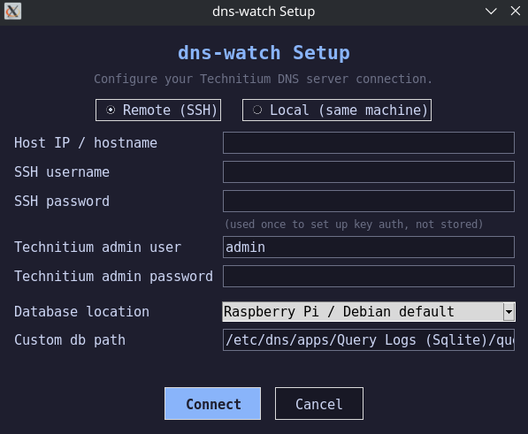

# dns-watch

A live DNS query dashboard for [Technitium DNS Server](https://technitium.com/dns/).

Shows all DNS queries in real time — upstream resolves, cache hits, and blocked domains — color coded. Font size is adjustable live from the toolbar so the display works comfortably at any distance or screen size.





## Requirements

- Linux (Debian/Ubuntu)
- Technitium DNS Server running on a reachable machine (Raspberry Pi, Linux box, etc.)
- The **Query Logs (Sqlite)** app installed in Technitium (Apps tab in the web console)
- SSH access to the machine running Technitium

## Install

```bash
git clone https://github.com/runnyroosts/dns-watch.git
cd dns-watch
./install.sh
```

Then run:

```bash
dns-watch
```

Or find **DNS Watch** in your app menu.

## First run

On first launch, a setup dialog will appear asking for:

- **Host IP** — the IP address of your Technitium machine
- **SSH username** — usually `pi` on a Raspberry Pi
- **SSH password** — used once to set up passwordless key auth, never stored
- **Technitium admin credentials** — to fetch an API token
- **Database location** — choose from common presets or enter a custom path

After setup, dns-watch connects automatically with no passwords required.

Settings can be re-run anytime via the ⚙ button in the top bar.

## Color coding

| Color  | Meaning  |
|--------|----------|
| Green  | Upstream — fresh DNS resolve |
| Blue   | Cached — served from Technitium cache |
| Red    | Blocked — sinkholed by a block list |
| Orange | Other — ServFail, Refused, etc. |

## Technitium setup

In the Technitium web console, go to **Apps** and install **Query Logs (Sqlite)** if not already installed. This is what dns-watch reads from.

## Config file

Settings are stored at `~/.config/dns-watch/config.json`. Delete this file to re-run setup.
